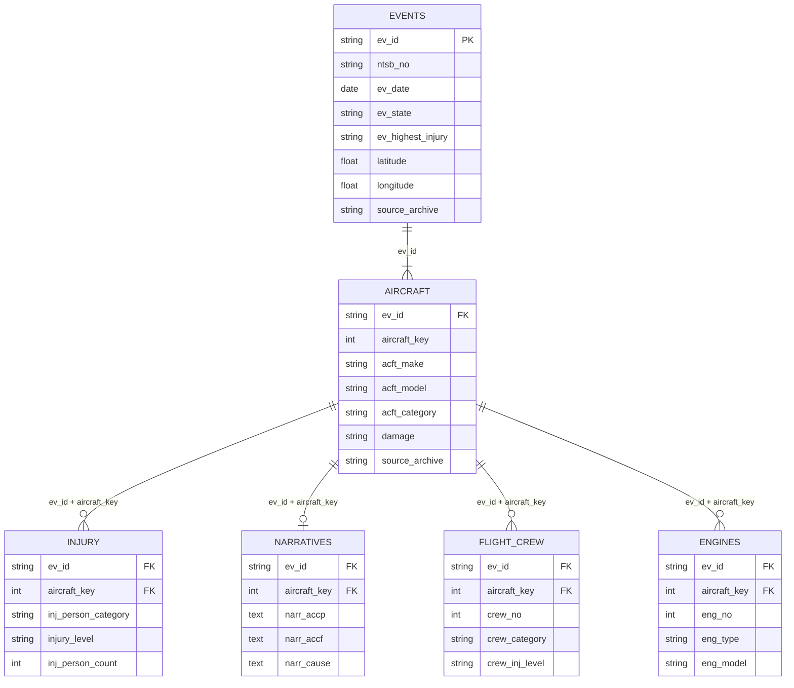

# Schema diagram

**Project:** NTSB Aviation Accident Database Curation  
**Tables:** 6 core tables derived from NTSB `.mdb` archives

> Note: NTSB does not publish a formal entity-relationship diagram for the
> *eADMSPUB* database. This diagram is reconstructed from the observed natural
> key columns in the curated CSVs and confirmed against the
> *eADMSPUB_DataDictionary* reference table.

---

## Entity-relationship diagram

---

## Schema notes

### ev_id as the universal join key

Every table in this database carries `ev_id` — the NTSB-assigned accident event
identifier. It functions as a persistent local identifier: stable across monthly
archive updates, unique within NTSB's system, and the sole join key between the
`events` table and every downstream table (Duerr et al., 2011). Its 14-digit
numeric format encodes the investigation date, making it both human-readable and
machine-processable. Because `ev_id` is assigned by NTSB and preserved verbatim
through extraction, any row in this dataset can be traced back to NTSB's
authoritative record using this identifier alone.

### Why aircraft_key exists

Most accidents involve a single aircraft, but mid-air collisions and runway
incursions produce multiple-aircraft events recorded under a single `ev_id`. The
`aircraft_key` field (integer, starting at 1) disambiguates aircraft within a
shared event. In this curated extract, 253 events produced 256 aircraft records,
confirming that three events each involved two aircraft. All tables below the
aircraft level — `injury`, `narratives`, `flight_crew`, `engines` — join on the
compound key `(ev_id, aircraft_key)`, not on `ev_id` alone. Researchers doing
cross-table joins must include both fields to avoid incorrectly merging crew or
engine data from different aircraft in the same event.

### Cardinalities

| Relationship | Type | Rationale |
|---|---|---|
| events → aircraft | one-to-one-or-many (1 : 1..\*) | Most events have one aircraft; multi-aircraft events are possible |
| aircraft → injury | one-to-zero-or-many (1 : 0..\*) | Multiple person categories × injury severity levels per aircraft |
| aircraft → narratives | one-to-zero-or-one (1 : 0..1) | At most one narratives record per aircraft/event pair; open investigations have none |
| aircraft → flight\_crew | one-to-zero-or-many (1 : 0..\*) | Pilot-in-command plus any additional crew members |
| aircraft → engines | one-to-zero-or-many (1 : 0..\*) | Single- and multi-engine aircraft; open investigations may have no record |

There are no many-to-many relationships in this schema. The structure is a
strict hierarchy: `events` is the single root, `aircraft` is the second tier,
and `injury`, `narratives`, `flight_crew`, and `engines` are all leaf tables
that cannot be reached without passing through both `events` and `aircraft`.
This hierarchy mirrors NTSB's investigative logic: every data point ultimately
belongs to a specific aircraft involved in a specific event.

### source_archive: curation-added provenance column

The column `source_archive` (visible in the `EVENTS` and `AIRCRAFT` entities
above) is not an NTSB field; it was added by `scripts/ntsb_extract.py` during
extraction and is present in all six core tables. It records which `.mdb` archive
each row originated from (`up01DEC.mdb`, `up01JAN.mdb`, `up01FEB.mdb`, or
`up01JUL.mdb`), enabling cross-archive provenance tracing at the row level. After
deduplication, `source_archive` reflects the most recent archive in which that
record appeared.

---

## References

Duerr, R. E., Downs, R. R., Tilmes, C., Barkstrom, B., Lenhardt, W. C.,
Glassy, J., … Slaughter, P. (2011). On the utility of identification schemes
for digital earth science data: An assessment and recommendations. *Earth
Science Informatics*, *4*(3), 139–160. https://doi.org/10.1007/s12145-011-0083-6
